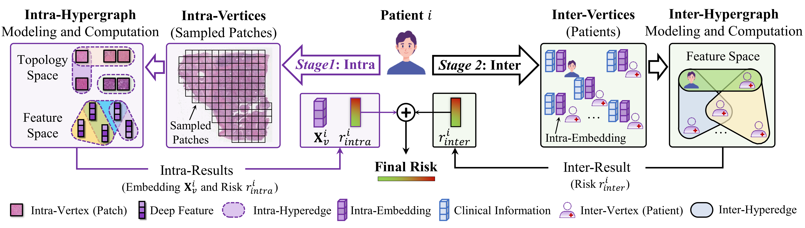

<div align="center">
<h2>Inter-Intra Hypergraph Computation for Survival Prediction on Whole Slide Images</h2>

<p align="center">
  <b>Xiangmin Han, Huijian Zhou, Zhiqiang Tian, Shaoyi Du, Yue Gao<sup>*</sup></b>
</p>

**IEEE Transactions on Pattern Analysis and Machine Intelligence (IEEE TPAMI), 47(7): 6006--6021, 2025**
</div>

Click the [link](https://ieeexplore.ieee.org/document/10948362) to access the paper.

# Introduction  
In this repository, we provide the training code for Intra-Hypergraph and Inter-Hypergraph models, along with various methods for hypergraph structure modeling. The dataset includes a sample list from publicly available datasets, which can be downloaded directly from TCGA.
<br>
<figure>
  
  <figcaption>(a) Multi-level medical information and corresponding correlations. Each subject contains multi-level medical information, such as intra-correlation at the cell and tumor level, and the inter-correlation at the group level. (b) Existing graph-based and MIL-based WSI analysis methods. (c) Different hypergraph modeling methods for WSI, the boundary-wise topological hypergraph models the boundary of WSI as hyperedges, the Spatial-wise Topological hypergraph considers the location interaction of patches as hyperedges, and the global-feature semantic hypergraph computes the feature distance to model the hyperedges.</figcaption>
</figure>

<br><br>

<figure>
  
  <figcaption>The pipeline of inter-intra hypergraph computation framework.</figcaption>
</figure>

<br>

## Training Data Structure  
- DIR: config
	- `xx.yaml` (your train/test config file)
- DIR: get_feature
	- `sampled_vis` (sampled patches, only for visualization)
	- `patch_ft` (deep features extracted via CNN models)
	- `patch_coor` (coordinates of the sampled patches, only for visualization)


# Training

### 1. Feature Extraction
This script will generate three types of files: `sampled_vis`, `patch_ft`, and `patch_coor`.
```bash
WSI_sample_patch.py
```

### 2. Training Intra-HGNN
You can train the `Intra-HGNN` model to obtain intra-embeddings and intra-risk. 
> Note that this module can be used independently.  
```bash  
python train_stage1_intra.py  
```

### 3. Training Inter-HGNN
You can train the `Inter-HGNN` model to fuse intra- and inter-risks for the final result. 
> Note that if you have defined the feature vectors of inter-vertices in the `inter-hypergraph`, you can train this module without the first stage.
```bash
python train_stage2_inter.py
```


# Citation
If you find our work useful in your research, please consider citing:
```bibtex
@article{han_2025_inter,
  title = {Inter-intra hypergraph computation for survival prediction on whole slide images},
  author = {Han, Xiangmin and Zhou, Huijian and Tian, Zhiqiang and Du, Shaoyi and Gao, Yue},
  journal = {IEEE Transactions on Pattern Analysis and Machine Intelligence},
  year = {2025},
  month = jul,
  volume = {47},
  number = {7},
  pages = {6006--6021},
  publisher = {IEEE},
  doi = {10.1109/TPAMI.2025.3557391},
}
```

# Contact
IIHGC is maintained by [iMoon-Lab](http://moon-lab.tech/), Tsinghua University. If you have any questions, please feel free to contact us via email: [Xiangmin Han](mailto:simon.xmhan@gmail.com).
